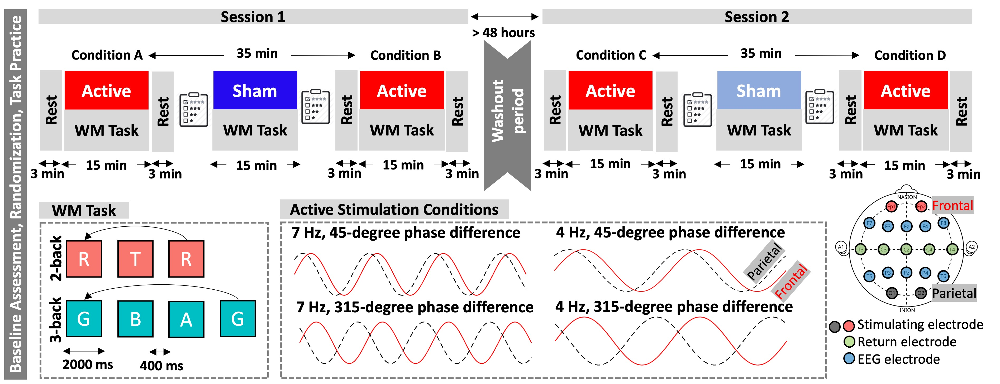

# Traveling Wave tACS and Working Memory

This repository contains behavioral and EEG data, analysis scripts, and results for our study investigating the effects of **frontoparietal tACS** with varying frequency and phase on working memory and resting-state EEG.

---

## 🧠 Study Design

This study used a **randomized, triple-blind, sham-controlled, crossover design** to assess the effects of phase- and frequency-specific frontoparietal tACS.

Each participant completed **two sessions** (≥48-hour washout), receiving both **active** and **sham stimulation**.

### ✅ Active Stimulation Conditions
Four active conditions varied by frequency and phase difference between frontal and parietal sites:

- `4 Hz @ 45°`
- `4 Hz @ 315°`
- `7 Hz @ 45°`
- `7 Hz @ 315°`

## 📊 Figure: Study Flow

The diagram below shows the structure of the stimulation sessions, including the order of active and sham blocks, EEG recordings, and behavioral assessments.

### ⚙️ Protocol Summary per Session
- Two active tACS blocks  
- One sham block inserted between active blocks  
- Working memory task during each block  
- **Resting-state EEG** (3 min) recorded before and after each block  
- Mood and memory questionnaires before and after the sham block  
- Each participant received **all four active conditions**, randomized across sessions  

### 🕶️ Blinding and Randomization
To ensure **triple blinding**:
- A team member uninvolved in data collection/analysis randomly labeled active conditions (A–D)
- A MATLAB script generated randomized stimulation orders
- Experimenters, participants, and analysts remained blinded throughout

---

## 🗂 Repository Structure

